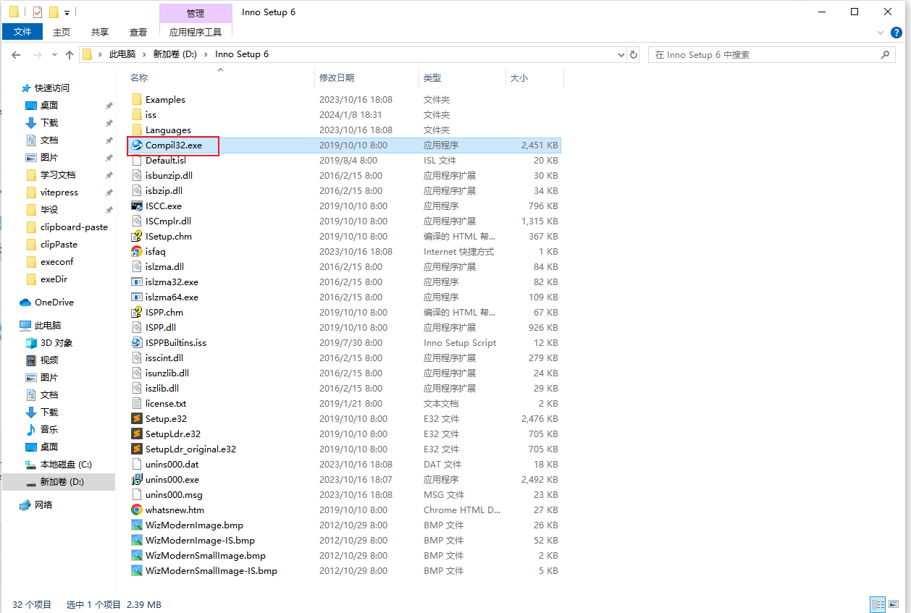
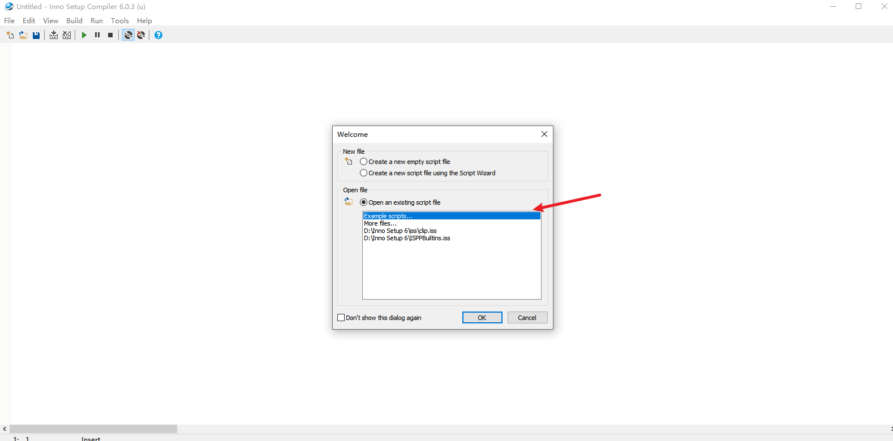

## 前言
在将控件打包为exe可执行程序以后，项目并不能`直接在用户机器上安装并启动`。我们的最终目的是让这个Java程序
能够像`原生Windows程序`一样被用户`安装`、`授权`、`无感知自启`

## 准备工作
你需要准备好来自exe4j打包的程序。如果你尚未拥有这一步的成果，**请看这篇文章**：
[进一步将本地粘贴控件打包为可执行程序](/posts/clipPaste/toExe)

然后你需要下载`Inno Setup 6`，记住，是`inno setup 6`，`inno setup`，版本是`6`，不然待会版本和我不一样，可能有其他问题。

> 好的，现在我假设你已经下载了inno setup 6。~~(没下的滚出克！)~~

## 脚本编写
> 这个编译器可以让你梦回`Dev c++`，~~太美丽了家人们！~~
### 开启软件

`安装路径`下去戳这个

戳开了是这样的，直接选就行了，会让你自己另存为脚本，自己保管好。



### 编写脚本

> 这一步抄作业就完事了，需要自定义的地方自行自定义就完事了。`（已高亮指出）`
>
> `标红的地方`是下一节`可信签名`的或者其他可有可无的代码，如果`不需要运行安全签名`可以先注释掉

``` pascal
; Script generated by the Inno Setup Script Wizard.
; SEE THE DOCUMENTATION FOR DETAILS ON CREATING INNO SETUP SCRIPT FILES!

#define MyAppName "ruifox clip helper" // [!code ++]
#define MyAppVersion "1.6" // [!code ++]
#define MyAppPublisher "小狐狸科技" // [!code ++]
#define MyAppURL "http://www.xiaohuli.com/" // [!code ++]
#define MyAppExeName "cliphelper.exe" // [!code ++]

[Setup]
; NOTE: The value of AppId uniquely identifies this application. Do not use the same AppId value in installers for other applications.
; (To generate a new GUID, click Tools | Generate GUID inside the IDE.)
AppId={{8730F218-3243-4552-9648-C5F9D85334C1}
AppName={#MyAppName}
AppVersion={#MyAppVersion}
;AppVerName={#MyAppName} {#MyAppVersion}
AppPublisher={#MyAppPublisher}
AppPublisherURL={#MyAppURL}
AppSupportURL={#MyAppURL}
AppUpdatesURL={#MyAppURL}
DefaultDirName={autopf}\{#MyAppName}
DisableProgramGroupPage=yes
; The [Icons] "quicklaunchicon" entry uses {userappdata} but its [Tasks] entry has a proper IsAdminInstallMode Check.
UsedUserAreasWarning=yes
; Uncomment the following line to run in non administrative install mode (install for current user only.)
;PrivilegesRequired=lowest // [!code ++]
OutputBaseFilename=ruifox-clip-helper // [!code ++]
SetupIconFile=D:\学习文档\图片资源\favicon.ico // [!code ++]
Compression=lzma
SolidCompression=yes
WizardStyle=modern
;设置不显示提示框
DisableStartupPrompt=yes
;禁止安装完成显示安装界面
DisableFinishedPage=no
;索要管理员权限
PrivilegesRequired=lowest
;是否打开->可选安装开始菜单项
AllowNoIcons=yes
;指定RSA算法进行代码签名
SignTool=sha1 // [!code --]
;SignTool=sha256 // [!code --]
SignedUninstaller=yes // [!code --]

[Languages]
Name: "english"; MessagesFile: "compiler:Default.isl" // [!code ++]

[Tasks]
Name: "desktopicon"; Description: "{cm:CreateDesktopIcon}"; GroupDescription: "{cm:AdditionalIcons}"; Flags: unchecked
Name: "quicklaunchicon"; Description: "{cm:CreateQuickLaunchIcon}"; GroupDescription: "{cm:AdditionalIcons}"; Flags: unchecked; OnlyBelowVersion: 6.1; Check: not IsAdminInstallMode
;开机自启动的标签，注册到用户的home目录。
Name: "startupicon"; Description: "{cm:CreateQuickLaunchIcon}"; GroupDescription: "{cm:AdditionalIcons}";

[Files]
;对启动文件进行电子签名
Source: "D:\exe4j\exeDir\cliphelper.exe"; DestDir: "{app}"; Flags: ignoreversion signonce // [!code --]
Source: "D:\exe4j\exeDir\*"; DestDir: "{app}"; Flags: ignoreversion recursesubdirs createallsubdirs // [!code --]
; NOTE: Don't use "Flags: ignoreversion" on any shared system files // [!code --]

[Icons]
Name: "{autoprograms}\{#MyAppName}"; Filename: "{app}\{#MyAppExeName}"
Name: "{autodesktop}\{#MyAppName}"; Filename: "{app}\{#MyAppExeName}"; Tasks: desktopicon
Name: "{userappdata}\Microsoft\Internet Explorer\Quick Launch\{#MyAppName}"; Filename: "{app}\{#MyAppExeName}"; Tasks: quicklaunchicon
;设置开机启动
Name: "{userstartup}\{#MyAppName}"; Filename: "{app}\{#MyAppExeName}"; Tasks:desktopicon

[Dirs]
Name: {app}; Permissions: users-full

[Run]
Filename: "{app}\{#MyAppExeName}"; Description: "{cm:LaunchProgram,{#StringChange(MyAppName, '&', '&&')}}"; Flags: nowait postinstall skipifsilent
Filename: "{sys}\cmd.exe"; Parameters: "/C echo {app}\{#MyAppExeName} >> %appdata%\Microsoft\Windows\Start Menu\Programs\Startup\ruifoxClip.bat"; Flags: runhidden

;写注册表
;[Registry]
;Root: "HKCU"; Subkey: "Software\Microsoft\Windows\CurrentVersion\Run"; ValueType: string; ValueName: "{#MyAppName}"; ValueData: "{app}\{#MyAppExeName}"; Flags: uninsdeletevalue
[Registry]
Root:HKCR;Subkey:FOXC;ValueType:string;ValueName:;ValueData:URL:Invoked Protocol Handler;Flags:uninsdeletevalue
Root:HKCR;Subkey:FOXC;ValueType:string;ValueName:URL Protocol;ValueData:;Flags:uninsdeletevalue
Root:HKCR;Subkey:FOXC\DefaultIcon;ValueType:string;ValueName:;ValueData:{app}\{#MyAppExeName};Flags:uninsdeletevalue
Root:HKCR;Subkey:FOXC\shell;ValueType:string;ValueName:;ValueData:;Flags:uninsdeletevalue // [!code --]
Root:HKCR;Subkey:FOXC\shell\open;ValueType:string;ValueName:;ValueData:;Flags:uninsdeletevalue // [!code --]
Root:HKCR;Subkey:FOXC\shell\open\command;ValueType:string;ValueName:;ValueData:"{app}\{#MyAppExeName} '%1'";Flags:uninsdeletevalue // [!code --]

[InstallDelete]
;卸载的时候删掉整个目录
Type: filesandordirs; Name: "{app}"

[UninstallRun]
;卸载时停掉程序以使得程序可以被安全删除
Filename: "cmd.exe"; Parameters: "/C taskkill /IM {#MyAppExeName} /F"; Flags: runhidden

```

### 运行脚本
软件`左上角`那个和`VC 6.0`的运行按钮长得一模一样的就是，点一下就开始运行了。
