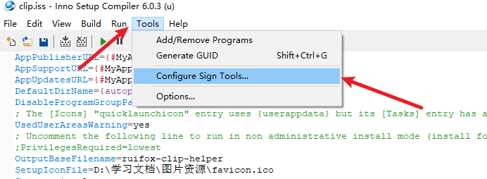
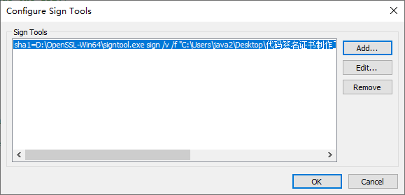
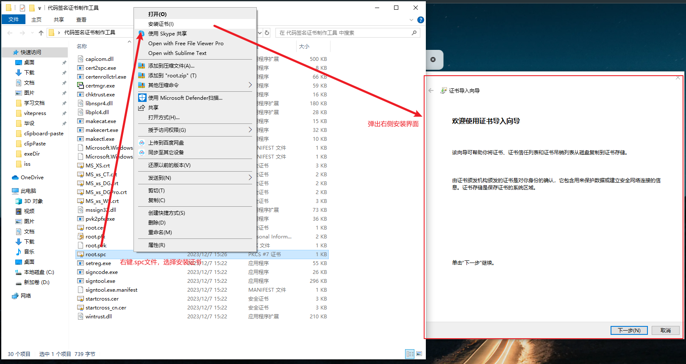
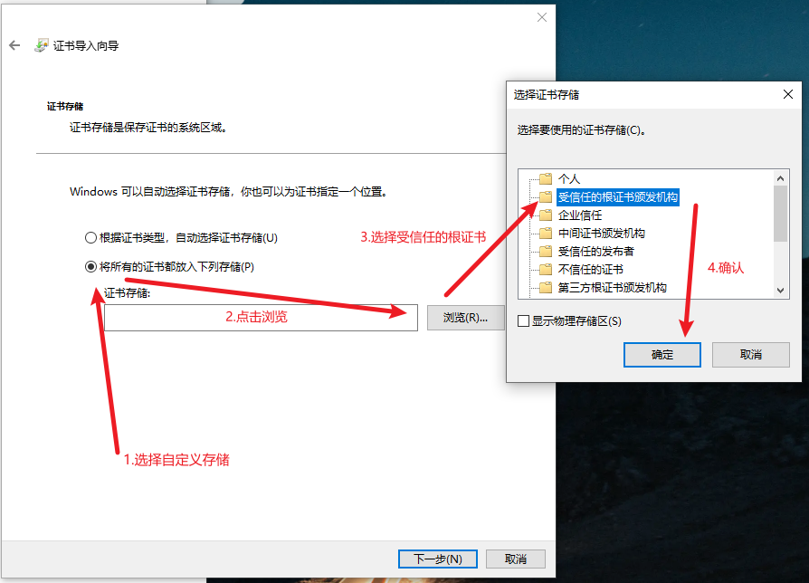
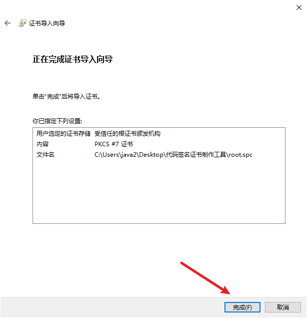
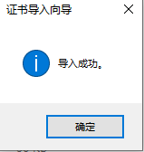

## 前言
在将控件打包编译为exe可安装执行程序以后，项目已经可以被正常安装并启动，但是很多人会发现一个问题，那就是`UAC界面报黄甚至爆红`，软件不能被安装，甚至不能被写入注册表。
我们这一节的目的是让这个问题能够得到彻底解决，包括但不限于：`写入start menu`(用于开机自启)、`写入注册表`、`写入网络端开启协议`。

## 准备工作
你需要准备好来自inno setup打包的可安装执行程序。如果你尚未拥有这一步的成果，**请看这篇文章**：
[进一步将本地粘贴控件打包为可安装执行程序](/posts/clipPaste/setup)

然后你需要再次开启`inno setup 6`,我们准备开始进行签名，在此之前，请你下载一个`Open SSL`,依旧是CSDN搜索大法好。

> 好的，现在我假设你已经打开了inno setup 6。~~(打不开的叉出去)~~

## 证书制作
啊，偷个懒，这篇文章就能完全解决：[完全免费的Windows代码签名证书（大神勿喷）](https://blog.csdn.net/dounick/article/details/105643285)

不得不说，用最谦虚的标题，写最有用的博客，真的是太厉害啦！在CSDN、简书、甚至stack overflow里翻了两三天，最终才找到了这篇算是真正解决了问题的博客。

## CER转PFX
好的，假设你已经通过上述代码完成了。现在你需要将`CER证书`转为`PFX证书`。

>  PFX证书用于运行签名，可以理解为信息加密的私钥

使用`Open SSL`执行：

```bash
 openssl pkcs12 -export -out pfx_file.pfx -inkey private_key.key -in cert_file.cer
```
在这个命令中，`-out`指定输出文件的路径，`-inkey`指定私钥的文件名，而`-in`则指定要转换的CER证书文件名。

## 配置签名工具

在`Inno setup 6`中，如下配置：

**第一步，点击`Tools`，再点击`configure sign tools`**



**第二步，配置签名算法和签名命令**

这一步具体看你使用的是什么算法，我使用的是`sha1`算法，故如此配置：

点击Add，输入`sha1`

点`OK`，设置签名路径：

```bash
D:\OpenSSL-Win64\signtool.exe sign /v /f "C:\Users\java2\Desktop\代码签名证书制作工具\root.pfx" /p "ruifox" /t http://timestamp.comodoca.com/authenticode $f
```

其中`D:\OpenSSL-Win64\signtool.exe`指向你的`signtool`所在位置;

`C:\Users\java2\Desktop\代码签名证书制作工具\root.pfx`指向你上一步生成的信息私钥证书

`/p`之后跟上加密证书的密码

`http://timestamp.comodoca.com/authenticode`是外置的时间戳服务器。`如果加密超时了自己科学上网就行了`。



## 配置加密脚本

这一步可以看上一篇文章中标红的部分，这里做一下着重讲解：

### 指向签名算法

在`[setup]`模块中，进行签名算法指定

```bash
;指定RSA算法进行代码签名
SignTool=sha1
;SignTool=sha256
SignedUninstaller=yes
```

### 指定自动签名包体

在`[Files]`模块中，载入指定的包模块进行自动签名

```pascal
[Files]
;对启动文件进行电子签名
Source: "D:\exe4j\exeDir\cliphelper.exe"; DestDir: "{app}"; Flags: ignoreversion signonce
Source: "D:\exe4j\exeDir\*"; DestDir: "{app}"; Flags: ignoreversion recursesubdirs createallsubdirs
; NOTE: Don't use "Flags: ignoreversion" on any shared system files
```

这里需要解释一下的是：

第一行指定`可执行文件`是为了绕过`安装时`的UAC校验，让软件可以正常下载安装、写注册表、写开机自启动栏。

第二行指定的是`运行时包体`，是为了绕过`软件启动时`的UAC校验，让软件可以正常启动和后台运行。

### 运行打包

还是点左上角那个运行按钮，不过加签名的话等待时间就长的多了，可以起身去喝杯开水。

### 证书安装

其实你打包出来的软件，如果没在本机装证书，依旧是不可行的。因为我们的证书是自己签名的，没有第三方CA机构背书，所以你需要`在本地安装.spc文件`。

#### 以本地证书形式安装

右键`.spc文件`，点击`安装证书`，进入安装界面，点击`下一步`



#### 安装到根证书目录

> 一定是根证书目录！不然部分杀毒软件还是会报毒



#### 完成安装

上一步点击确认后到下一步，点击`完成`



最后提示完成导入即可



### 完结
> 到这里，其实已经完成了软件的所有打包和签名了，总的说来还是不难，就是很繁琐，弯弯绕绕的，而且网上的教程大部分都是一知半解的，甚至还有广告商混在里边，不告诉你根证书咋来的，就想着你买他家的。
