## 准备工作

### 所需材料

- 项目运行所需要一起导入的`jre`
- 目标jar包
- exe4j（自己去下）

> 需要注意，`jre`包用于在`没有Java环境`的PC上运行插件。

### jre制作

jre的制作相对来说比较简单。仅需要按照如下步骤照做即可

#### 获取jre模块

打开你的cmd窗口，键入:(~~没装Java环境的叉出去~~)

```bash
java --list-modules
```

#### 编译最小化jre

还是这个cmd窗口，此时你应该通过上一步拿到所有的module了，这就是`按需编译`和`全量编译`的区别，如果你想体积更小，可以去探测这个jar包具体使用了哪些module，然后按需打包进去，这里我比较懒，就全量编译了。

- 去掉man-page，也不需要什么帮助，这部分文件很大，直接删掉
- 压缩等级设置到最高
- 跳过debug直接生成
- 不需要header-file

> 因为需要单行执行，所以说这里直接给出单行的代码。

**全量编译，直接执行就行**

```bash
%JAVA_HOME%\bin\jlink --module-path %JAVA_HOME%/jmods --add-modules java.base,java.compiler,java.datatransfer,java.desktop,java.instrument,java.logging,java.management,java.management.rmi,java.naming,java.net.http,java.prefs,java.rmi,java.scripting,java.se,java.security.jgss,java.security.sasl,java.smartcardio,java.sql,java.sql.rowset,java.transaction.xa,java.xml,java.xml.crypto,jdk.accessibility,jdk.attach,jdk.charsets,jdk.compiler,jdk.crypto.cryptoki,jdk.crypto.ec,jdk.crypto.mscapi,jdk.dynalink,jdk.editpad,jdk.hotspot.agent,jdk.httpserver,jdk.internal.ed,jdk.internal.jvmstat,jdk.internal.le,jdk.internal.opt,jdk.internal.vm.ci,jdk.internal.vm.compiler,jdk.internal.vm.compiler.management,jdk.jartool,jdk.javadoc,jdk.jcmd,jdk.jconsole,jdk.jdeps,jdk.jdi,jdk.jdwp.agent,jdk.jfr,jdk.jlink,jdk.jshell,jdk.jsobject,jdk.jstatd,jdk.localedata,jdk.management,jdk.management.agent,jdk.management.jfr,jdk.naming.dns,jdk.naming.ldap,jdk.naming.rmi,jdk.net,jdk.pack,jdk.rmic,jdk.scripting.nashorn,jdk.scripting.nashorn.shell,jdk.sctp,jdk.security.auth,jdk.security.jgss,jdk.unsupported,jdk.unsupported.desktop,jdk.xml.dom,jdk.zipfs --output clipjre --strip-debug --compress=2 --no-header-files --no-man-pages
```

**增量编译，自己带模块**

```bash
%JAVA_HOME%\bin\jlink --module-path %JAVA_HOME%/jmods --add-modules <在这里列举模块,逗号隔开> --output <jre文件名> --strip-debug --compress=2 --no-header-files --no-man-pages
```

### exe4j

> 莫下到盗版的咯，百度上烂货多得很，直接去CSDN搜`exe4j下载安装`，hxd们不会骗你滴

## 使用exe4j打包exe

### 新建或者导入工程

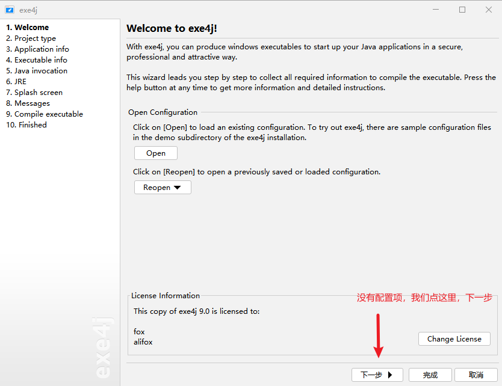

### 模式选择

> 在这里选择`JRE和JAR`的混合模式，打包为混合包

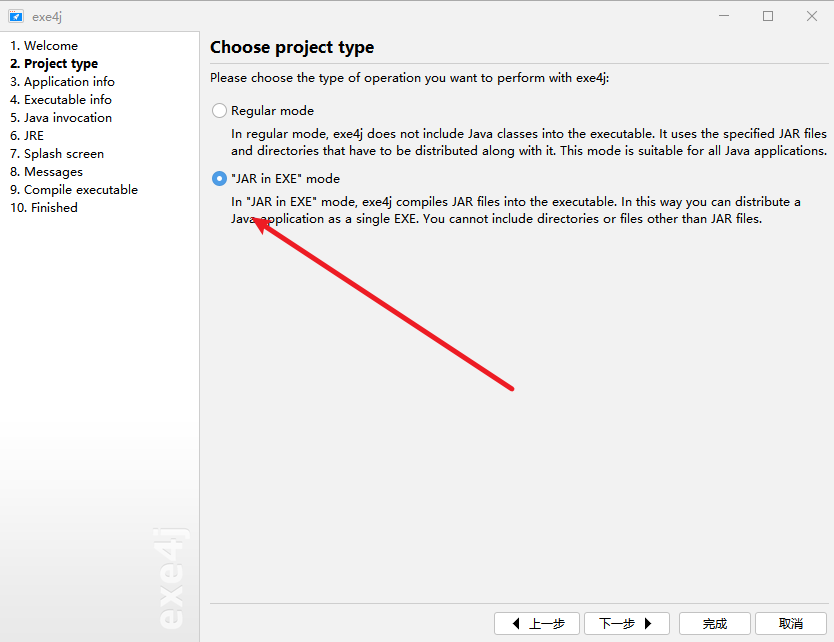

### 应用名称和输出路径

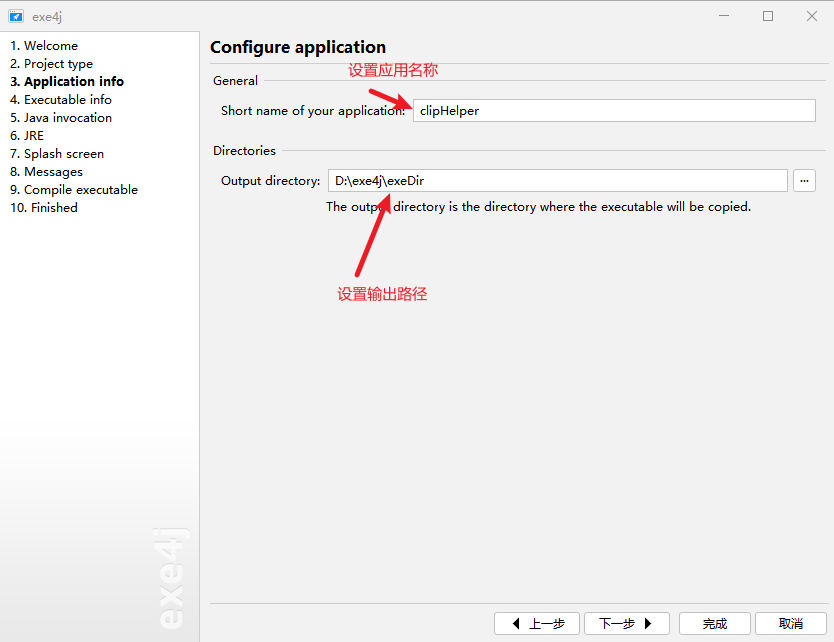

### 可执行程序信息

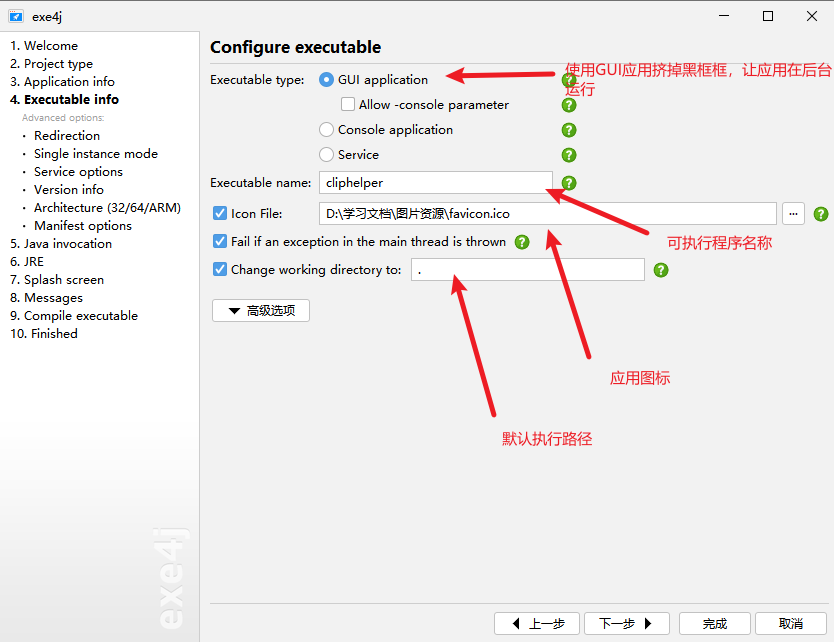

#### 服务配置（跳过）

因为我们是GUI服务，这几项可以直接跳过：

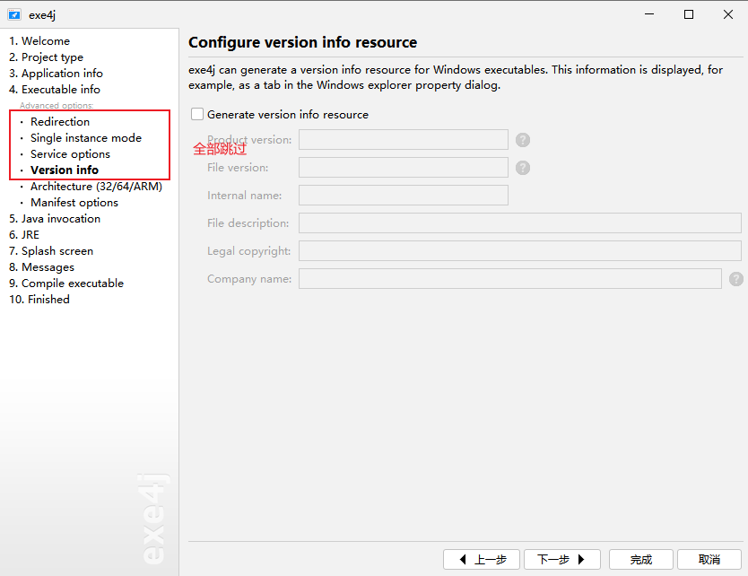

#### 计算机架构

> 按需选择，我是Windows X86架构，所以说选择X86

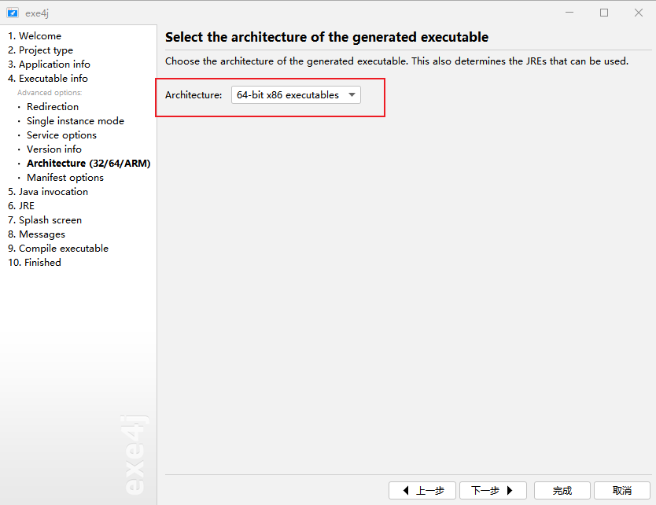

#### 编译选项

> 因为我是`JDK 11`,所以直接选择9+了。8应该也可以选9+，问题不大，用不上swing

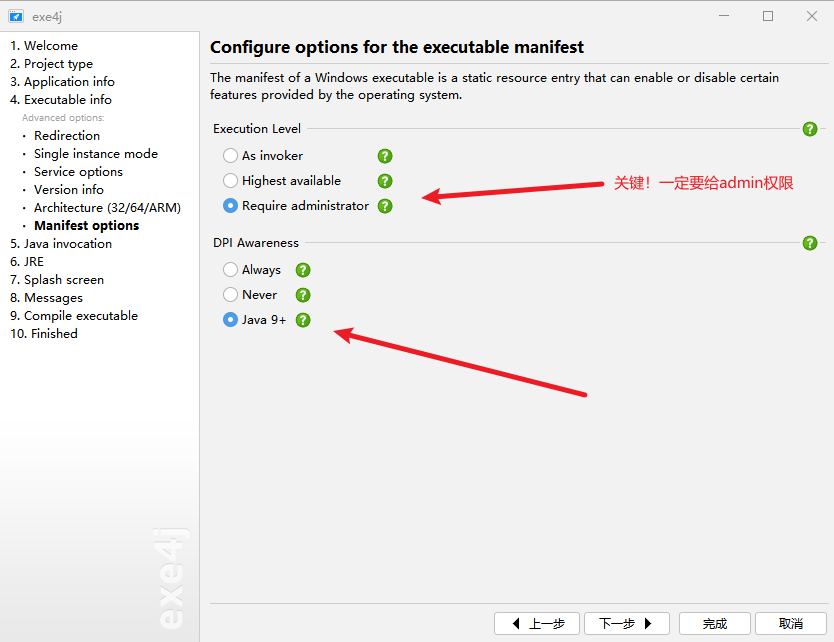

### 入口编译和VM参数指定

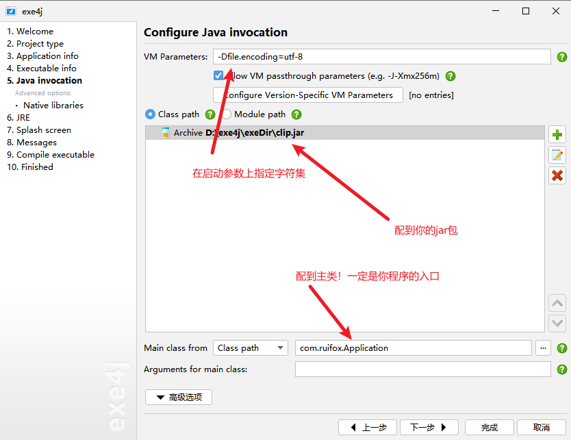

### JRE启动容许

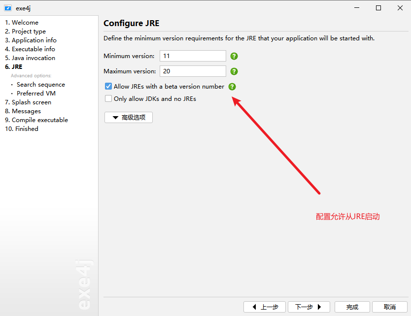

### JRE配置

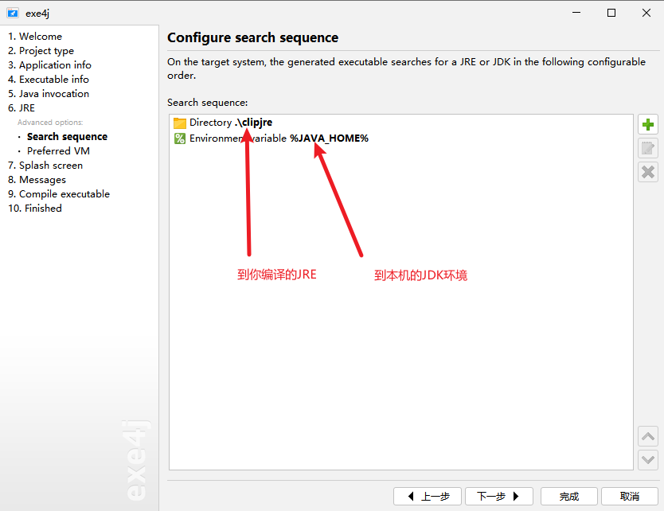

#### 虚拟机指定

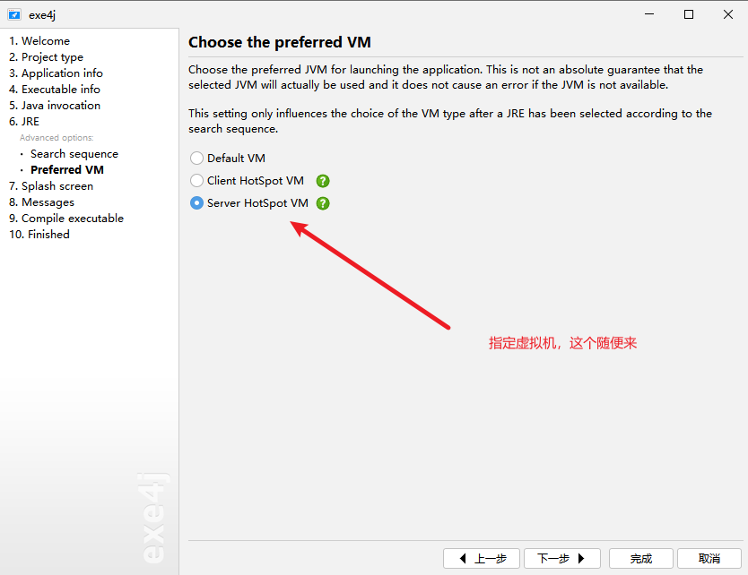

### 完成构建

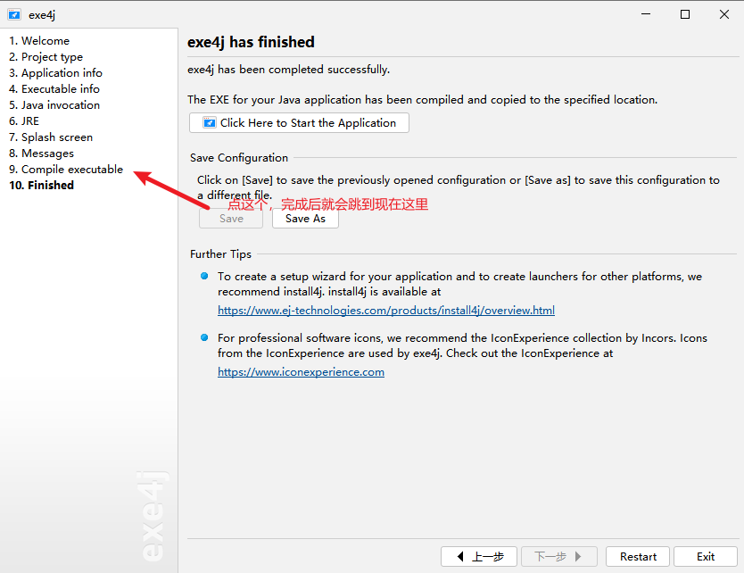

### 查看成果

> 应该有内容输出到目标路径了，如下所示

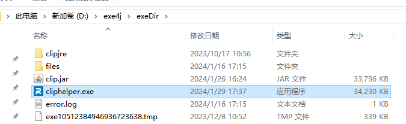

