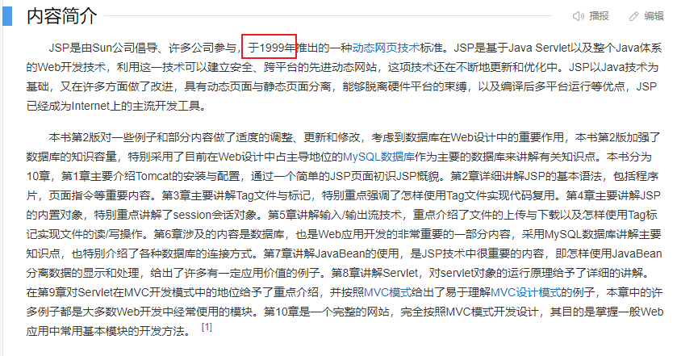
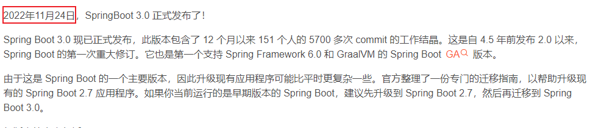

## 2024.02.23随笔
### 序言
> 诗词曲赋都纠结一个序文，无论是这个新年，还是写下的这些文字，都应该开个好头。
> 今日份成都的雨夹雪迫使我再次穿上大棉袄，在倒春寒的极端天气里，天还没亮就踩着单车去上班。
> 小时候期待赶紧长大，直到去年三月份真正在公司开始实习，第一天的茫然就让我开始怀恋读书的日子。
> 但是，谁让自己选了个“天坑专业”呢，不实习，就没有实际项目产出，就没有简历亮点，就没有秋招入门券。
> 没有秋招入门券，就没有工作，没有工作，基本上和计算机这一行说拜拜了。

### 规划
一个好的规划真的很重要，我最近一年都是翻来覆去睡不着。行业大变局是真的在朝夕之间。

高中时期的我，特别贪玩，最后拿着差不多211摸门槛的分，拒绝了复读一年的建议，最后上了本省的一所双非的王牌专业——`软件工程`。

因为我从小的梦想，就是要在代码世界寻找到我自己的意义，为此，我在选专业的时候放弃了选择文科，转投理科（当时我的文科比理科好一点，也没好很多）。

我入学的时候，我们学校的计算机专业还是非常热门的，主要是本校的王牌专业，计算机这边占了一大半，分都不低，计科和我们软工还被叫做"小电子科大"，
整个成都大大小小的互联网公司的高管，都有我们学校的校友（甚至包括蚂蚁集团-成都）。

就这样，拿着差不多算是名校的加持，再加上当时对软工专业“21世纪工科版本之子”的美誉，我们迎来了戏剧性的颠覆。

> 由于疫情影响，阿里集团裁员50%

随后这一裁员浪潮开始铺天盖地地席卷开来，腾讯裁员、华为裁员、字节裁员、百度裁员...

之后，~~裁员的优良作风被国外的厂商学去~~，谷歌裁员，甲骨文裁员，亚马逊裁员，时至今日，微软还在玩灭霸式的随机裁员，在微软待了20多年的软件工程师运气不好被抽到了，照样被开。

一时间，整个计算机专业，从所谓的版本之子跌落谷底，成为了继`生化环材`后第五大天坑专业。

### 什么是天坑专业？
说到这里，我想回复一下当年的我，什么是天坑专业,~~可惜我现在才懂啊~~。
计算机其实`一直是天坑专业`，这一点我希望得到认同。很多人喜欢把冷门和天坑联系到一起，在我看来，天坑专业其实判别方式很简单：`真实就业率`。

更多的，还有`就业难度`、`考研难度`。以计算机专业为例，热门吧？前景好吧？大家都喜欢吧？体面吧？

我可以这样说，计算机的真实就业率基本上是一个学校垫底的，我们专业去年真实就业率`18%`，就业率比入党率还低。考研难度这是公开的，最难的四个大专业之一，和`金融`、`法学`并驾齐驱。

至于就业难度，我可以这样说，当我习惯了计算机专业的就业难度以后，我是真的被大部分专业的`是个人就行`整蒙了。

### 什么是学习成本?
找到一个好的专业，学习成本是最重要的，它直接决定了你的大学四年要怎么过，才能达到这个行业的入门标准。

可以很负责地说，大部分工科，教育脱节，这件事根本就不是秘密。

说专业的名词，门外客都不懂，我也只会本专业的东西，那就拿两张图片来自行比对感觉一下吧，经典的登录页。
> 这是学校教你的

> 这是你在工作中要做的

**这个还不敏感的话，看下边这个对比：**
> 这是学校教你的

> 这是你工作要用的

很多专业看着很吃香，`学习成本高啊`，计算机整个大类都是典型例子。

因此，选择专业的时候要想好，你想拿那个行业的红利，但是代价是什么？你能管住自己么？

我可以更负责任的说，很多专业，更新换代很快，但是教育制度大家是有目共睹的，不只是计算机，像芯片、物联网、机械，一样的快。

互联网开发框架现在是三年一换，但是学校在教的框架，很多`比我都老`。额外的学习成本得自己想想有多少？

要学的东西也多，还是以我本身的专业为例，这么说吧，`计算机网络`、`算法`、`计算机组成原理`、`操作系统`，这是基础，但是是计算机专业学生头上四座大山，然后实际工作要用的开发语言，
三门左右，要学的数据库，四门左右，再加上最近`国产化趋势`，更多了。框架，10个左右，而且随时要根据业务学新的框架，其他的理论知识，更是多。

> 看完以后，我希望我目前在整个大学的阅历，能够产生一些共鸣，得到一些肯定。
### 写在最后
其实选专业最主要的还是`关注时政要闻`，串联起来。

我入学的时候IC类专业还是天坑，所谓毕业即失业。

但是大家都知道我们国家芯片被制裁了啊，国家肯定要发展芯片行业啊，但是大家都只看眼前这点利益，没去深入思考。

结果就是现在IC专业水涨船高，短短三年时间直接逆袭工科希望之星。

所以说，天坑专业也不一定不好，热门专业也不一定好，希望多做了解再下定论，这是对曾经热血沸腾的我，最真诚的告诫。
目光短浅的人，永远走不远。
