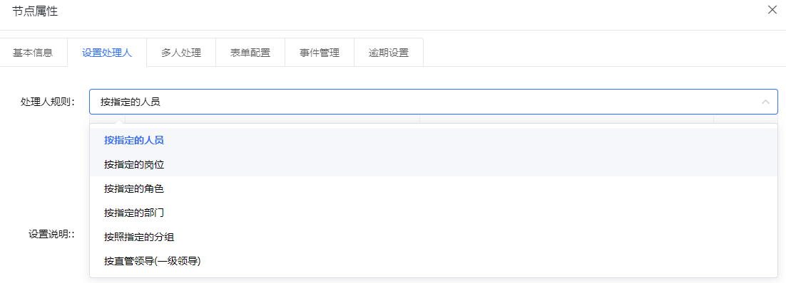

## 前言
在原有的系统中，已经有了按**指定审核人审核、按指定部门审核、按审核组审核、按角色审核**等选项，
但是很多情况下，需要新增一些奇怪但必要的规则处理（比如说直管领导审核、一级领导审核等）。
本篇在此基础上，结合实例对项目的流程运行进行抽丝剥茧。

## 规则注册
这一部分主要注意的是整体的规则调用链路。目前规则是在前端被**固定写入**的（也可以为了卖个扩展，写到后台动态开权限，但是真没必要）。
### 调用链路解析
首先注意到表单设计器的视图,从本代码块往后走就是完整的调用链路：
:::code-group
```vue[UserTaskProperties.vue]
<!--本块中调用了usertask视图-->
   <el-row>
      <el-col :span="24">
          <user-task :id="TaskModel.id" :type="type" :element="ruleElement"></user-task>
      </el-col>
   </el-row>
```
```vue[UserTask.vue]
<!--本块中调用了一个参量，taskRules-->
<el-select v-model="userTaskForm.taskRules" @change="updateElementTask('taskRules')">
        <el-option
          v-for="(trs, index) in taskRules"
          :key="index"
          :label="trs.taskRuleName"
          :value="trs.ruleKey"
        />
</el-select>
```
```js[还是UserTask.vue]
//这一部分重点在过程节点选项控制
if (taskType == 'bpmn:StartEvent') {
      this.taskRules = this.getStartRules;
 } else {
      this.taskRules = this.getTaskRules;
}
```
```js[taskRule.js]
export default {
    namespaced: true,
    state: {
        taskRules: [{
          taskRuleId: 1,
          ruleKey:'byUser',
          taskRuleName: "按指定的人员"
        },
        ...
        ]
    },
    getters: {
        getTaskRules: state => {
          return state.taskRules;
        }
    }
};
```
:::
### 上手修改
所以说，需要修改的地方也就显而易见了，我们只需要先在`taskRule.js`中新增一个`taskRule`，命名为`部门领导审核`：
```js
{
  taskRuleId: 6,
    ruleKey:'byDeptMaster',
    taskRuleName: "按直管领导(一级领导)"
}
```
### 测试验证
这时候再去页面上查看，可以看到设计器此时已经注册了这个规则：

## 规则定义
这一部分主要是对规则选择后进行具体定义。我们在上文中查看代码调用链路时，可以看到`UserTask.vue`中有这样的代码：
::: code-group
```vue[规则选择器]
<el-select v-model="userTaskForm.taskRules" @change="updateElementTask('taskRules')">
        <el-option
          v-for="(trs, index) in taskRules"
          :key="index"
          :label="trs.taskRuleName"
          :value="trs.ruleKey"
        />
</el-select>
```
```vue[处理器]
 <div v-if="processTaskRule == 'byRole'">
        <template>
          <el-select v-model="userTaskForm.assigneeRoles" multiple placeholder="请选择角色">
            <el-option v-for="item in assigneeRoles" :key="item.id" :label="item.name" :value="item.id"></el-option>
          </el-select>
          <div class="element-drawer__button">
            <el-button size="mini" type="primary" icon="el-icon-plus" @click="saveAssigneeByUser('byRole')">确认</el-button>
          </div>
        </template>
 </div>
```
```js[接口请求]
const res=await getOrgData();
        if (res.error == '200') {
          this.assigneeRoles = res.result.rolesList;
          this.deptList=res.result.departList;
          this.assigneePosition = res.result.positionList;
          this.groupList=res.result.groupEntityList;
        }
      },
```
:::

所以说我们的目标就显而易见了：根本不用写规则处理器。因为直管领导，在这时候还不知道是谁呢（流程只有在启动的时候，才知道流程上绑定的人是谁）
那么我们的难点就来到了后端。后端要在`流程启动或者流程流转`的时候，准确捕捉到在这个扩展节点上的人是谁。
