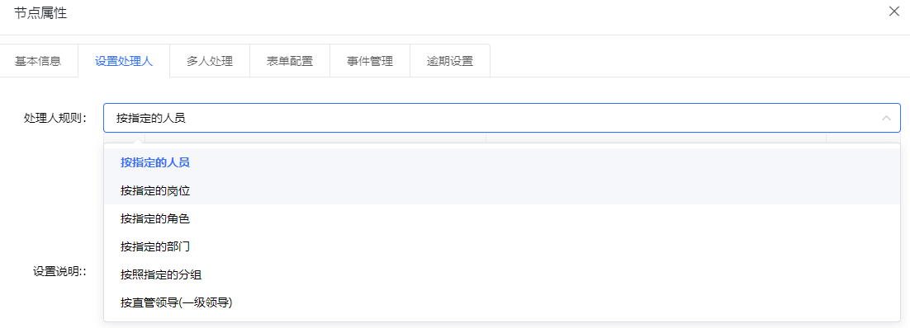
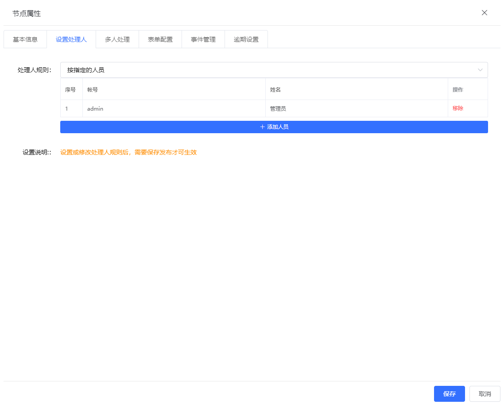
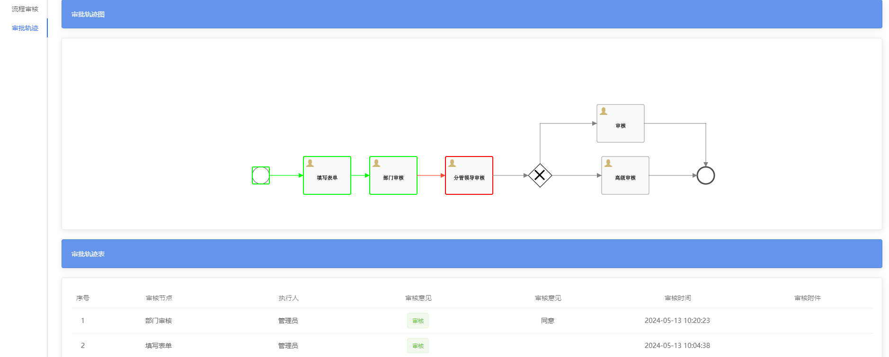

## 前言
在上一部分文档中，我们按照规则对前端进行了扩展。现在我们将从后端代码出发，进行相关功能扩展。
需要注意的是，本节涉及到的后端调用链路非常之长，请试着自己也打开调试器跟着一步一步走。

## 步骤概览
> 在这整套扩展逻辑中，整体的扩展被分为了两个部分，分别是`部署注册`和`执行发送`。
>
> 部署注册主要是发生在**流程部署阶段**，你的流程部署的找人逻辑应该在这个阶段被注入到流程里边，
> 告诉系统怎么去找人，是按部门还是按岗位，或者是按直管领导找人

### 部署注册
这一部分主要就是把扩展的审核逻辑注册到流程上。主要的工作其实是分了两个接口来完成，大致的实现思路如下：
1. 流程设计时，管理员设计流程节点后，点击确定，系统将找人逻辑注册到Redis。
2. 流程设计完成后，系统部署，流程进行节点检测
3. 节点检测过程中，系统筛选出里边的用户任务，然后从redis去拉缓存，看用户注册的内容，主要包括三个关键要素：`节点值`、`节点ID`、`节点找人方式`
4. 节点注册的找人逻辑注册到数据库。这一部分参阅数据库表`as_taskuser`

### 执行发送
部署注册相对简单，我们主要讲解的重点是执行发送这个节点是怎么运行的。通过对流程系统的研究，流程系统的发送执行过程大致是如下这么走的：
1. 登录用户账户（这一步要注意，不是你自己系统的那个状态，是`Activiti 7`内嵌的spring security的登录状态）
2. 获取任务信息参数，执行流程节点发送前事件。
3. 依照任务信息设置抄送路径
4. 判断任务是否退回，如果退回的话，去执行退回逻辑（可能是已经被退回过的，会被忽略；其他退回的走退回逻辑回滚到退回节点）
5. 判断任务是否被领取，没有的话就自动领取（这一部分自己去了解一下流程系统里领取任务的概念，简而言之就是一个任务如果只能是一个人审核但是审核队列存在多个候选人的，
比如说一个离职申请丢到人资组，但是又不需要所有HR都去审核，只需要一个HR去领取，那么只要有一个人资组的HR进去审批领取了，其他人就不能审批了。）
6. 寻找下一个节点，并更新流程标题（如果需要）
7. 判断流程下一个节点是否`串行多重事件`、`并行多重事件`、`单用户事件`
8. 在步骤7的基础上，按照注册的找人策略进行找人。**我们的扩展点就在这里。**
9. 找到人后，`预存变量提交`。**这一步非常重要！！！**，这个没做的话，系统会报错。
10. 判断**是否手动发送路径**。如果是手动发送路径，就需要在这里结束方法，返回给用户分叉路径让用户选择。（手动发送路径在本系统里是系统的某个节点之后有一个互斥网关，
互斥网关后有`两个或者更多的非路径节点`，那么就会触发条件选择路径。当条件选择模式配置为**用户手动选择**时，即为手动发送路径）
11. 在工作流引擎上提交本次任务和流程变量
12. 通知用户审核
13. 增加审核记录到数据库里，并在redis里记录接收人，然后将接收人发送到执行后处理器
14. 执行流程节点发送后事件
15. 判断流程是否结束，如果结束了应该归档流程，并且将流程管理操作置为不可用，然后向发起者发消息通知流程结束

## 部署注册逻辑
部署注册分为两个接口和两个阶段，准确来说是：`注册到Redis`和`部署到数据库`。两个阶段本质上分别是进行数据临时覆盖和数据永久覆盖工作。
### 注册到Redis
这一步主要是在流程设计这里，还记得我们前边扩展了流程，这里相应地给他完善一下前端交互逻辑
#### 前端提交修改
可以看到，目前前端是只有个选择，但是没有相应的确认提交到Redis的按钮，我们要么把确认绑定到保存事件上，要么绑定到部署事件上。



参考系统原本的界面：



其实打开本地调试器，可以发现系统在添加人员上做了个提交redis的接口请求，那么我们也只需要给他加个重复确认的行为就行了。

:::code-group
```vue[案例样板(按用户筛选)]
<div v-if="processTaskRule == 'byUser'">
        <el-table :data="assigneeUserList" size="mini" max-height="240" border fit>
          <el-table-column label="序号" width="50px" type="index" />
          <el-table-column label="帐号" prop="username" show-overflow-tooltip />
          <el-table-column label="姓名" prop="name" show-overflow-tooltip />
          <el-table-column label="操作" fixed="right" width="90px">
            <template slot-scope="{ row, $index }">
              <el-button
                size="mini"
                type="text"
                style="color: #ff4d4f"
                @click="removeUser(row, $index)"
                >移除</el-button
              >
            </template>
          </el-table-column>
        </el-table>
        <div class="element-drawer__button">
          <el-button
            size="mini"
            type="primary"
            icon="el-icon-plus"
            @click="openUserbutesForm(null, -1, 'byUser')"
            >添加人员</el-button
          >
        </div>
      </div>
```
```vue[依葫芦画瓢]
<div v-if="processTaskRule == 'byDeptLeader'">
        <template>
          <div class="element-drawer__button">
            <el-button
              size="mini"
              type="primary"
              icon="el-icon-plus"
              @click="saveAssigneeByUser('byDeptLeader')"
            >确认</el-button>
          </div>
        </template>
      </div>
```
:::
这样前端就跟着扩展完成了。
#### 后端提交到Redis
前端传入数据以后，后端需要给这些岗位数据持久化到Redis，具体看这个接口的相关代码：
:::code-group
```java[TaskAssigneeController.java]
    @OperLog(operModul = "流程任务相关" , operType = LogConst.OTHER , operDesc = "设置用户任务中设置的规则数据")
    @PostMapping("/as/setAssigneeUser")
    public ResultRes setAssigneeUser(@RequestBody JSONObject param){
        return ResultRes.success(assigneeUserService.setAssigneeUser(param));
    }
```
:::

### 持久化到数据库
#### 接口层
这一部分是在用户点击部署流程时执行，具体查看接口：
:::code-group
```java[ProcessDefinitionController.java]{11}
    /**
     * 流程发布
     * @param param
     * @return
     */
    @OperLog(operModul = "流程定义相关" , operType = LogConst.INSERT , operDesc = "流程发布")
    @PostMapping(value = "/deployment/deployWithBPMNJS")
    public ResultRes deployWithBPMNJS(@RequestBody JSONObject param,String tenantId){
        String stringBPMNXml=param.get("stringBPMNXml").toString();
        try {
            return ResultRes.success(processDefinitionService.deployWithBPMNJS(stringBPMNXml,tenantId));
        }
        catch (Exception ex){
            return ResultRes.error(ex.getMessage());
        }
    }
```
:::
#### 服务层
在接口调用的`processDefinitionService.deployWithBPMNJS(stringBPMNXml,tenantId)`这个方法上，我们向下进行寻找：
:::code-group
```java[IProcessDefinitionServiceImpl.java]{8}
        @Override
    public String deployWithBPMNJS(String BPMNXml, String tenantId){
        Deployment deployment = repositoryService.createDeployment()
                .addString("createWithBPMNJS.bpmn",BPMNXml)
//                定义租户ID
                .tenantId((tenantId==null || tenantId.equals(""))?"main":tenantId)
                .deploy();
        iProcessDefinitionManager.createTask(deployment.getId());
        return deployment.getId();
    }
```
#### 扩展点
:::
进入`iProcessDefinitionManager.createTask(deployment.getId());`这个方法，我们可以看到，其中包含了对`UserTask`的筛选，那么就是我们要找的地方了。
此时注意这段代码：
:::code-group
```java[UserTask处理循环]{5}
                    if (redisUtils.exists(usertaskId + "_" + ruleName)) {
                        assigneeString = redisUtils.get(usertaskId + "_" + ruleName).toString();
                        deleteAssigneeUserByTaskid(usertaskId);
//                        TODO:设置签入人
                        setAssigneeUser(assigneeString, usertaskId, ruleName);
                    }
```
:::
这段代码先删掉了原有规则，然后去创建新的规则，那么我们继续沿着调用链路前进，这里就是扩展的地方了。
> 注意一个问题，进来了这个方法，你可能会发现一个问题，它的参数列表构成是：
> `public String setAssigneeUser(String assigneeList, String usertaskid,String ruleName)`。
> 后边两个，taskId和ruleName我们都给了，关键是assigneeList这个变量是空的，但是下边的数据处理是：

```java
List<AssigneeUserEntity> assigneeUserEntityList = Optional.ofNullable(userlist)
                .map(list->list.stream().map(it->{
                    JSONObject json = JSONObject.parseObject(JSON.toJSONString(it));
                    AssigneeUserEntity assigneeUserEntity = new AssigneeUserEntity();
                    if(SystemConfig.IsNullOrEmpty(json.getString("username"))){
                        assigneeUserEntity.setUsername(json.getString("id"));
                    }
                    else {
                        assigneeUserEntity.setUsername(json.getString("username"));
                    }
                    assigneeUserEntity.setUsertaskid(usertaskid);
                    assigneeUserEntity.setRuleName(ruleName);
                    assigneeUserEntity.setId(UUID.randomUUID().toString());
                    return assigneeUserEntity;
                }).collect(Collectors.toList())).orElse(new ArrayList<>());
```
如果这个参数是空，那么下边执行的插入：`assigneeUserMapper.setAssigneeUser(assigneeUserEntityList);`也不会生效。
所以说我们要找个方法扩展进去，那么就可以这样子改造一下：
:::code-group
```java[IProcessDefinitionManager.java]
public String setAssigneeUser(String assigneeList, String usertaskid,String ruleName){
        JSONArray userlist = JSONObject.parseArray(assigneeList);
        List<AssigneeUserEntity> assigneeUserEntityList = Optional.ofNullable(userlist)
                .map(list->list.stream().map(it->{
                    JSONObject json = JSONObject.parseObject(JSON.toJSONString(it));
                    AssigneeUserEntity assigneeUserEntity = new AssigneeUserEntity();
                    if(SystemConfig.IsNullOrEmpty(json.getString("username"))){
                        assigneeUserEntity.setUsername(json.getString("id"));
                    }
                    else {
                        assigneeUserEntity.setUsername(json.getString("username"));
                    }
                    assigneeUserEntity.setUsertaskid(usertaskid);
                    assigneeUserEntity.setRuleName(ruleName);
                    assigneeUserEntity.setId(UUID.randomUUID().toString());
                    return assigneeUserEntity;
                }).collect(Collectors.toList())).orElse(new ArrayList<>());
//        TODO:扩展无具体指代人的找人方式挂载 // [!code ++]
        /*这里扩展找人方式，目前有按部门主管和部门直属领导的方式，在本节进行扩展。由于没有具体的指代人或者机构，上述循环代码不会执行*/ // [!code ++]
        List<String> extensionRule = Arrays.asList("byDeptMaster", "byDeptLeader"); // [!code ++]
        if (extensionRule.contains(ruleName)){ // [!code ++]
            assigneeUserEntityList.add( // [!code ++]
                    new AssigneeUserEntity(UUID.randomUUID().toString(), usertaskid, "", "", ruleName, null) // [!code ++]
            ); // [!code ++]
        } // [!code ++]
        assigneeUserMapper.setAssigneeUser(assigneeUserEntityList);

        return "执行成功";
    }
```
:::
这样我们扩展的方式就能被正常持久化到数据库了。

## 执行发送逻辑
执行发送的核心扩展逻辑是找人。只要你提供给系统找人逻辑，系统就能把消息发到对应的人那里去。到达执行发送的路径都是唯一的，就那几个。
首先看如下的代码内容：
### activiti登录
> activiti框架是强依赖spring security的，而且和你的spring security是不互通的。你只能**从自己的security里获取到当前用户登录信息，再到activiti 7里边去登录**，这个很重要。
:::code-group
```java[IProcessTaskServiceImpl.java]{4-6}
    @Override
    public SendActionDto sendWork(ProcessTaskParams processTaskParams){
        //获取当前登录用户信息
        Authentication authentication = SecurityContextHolder.getContext().getAuthentication();
        String username=authentication.getName();
        securityUtil.logInAs(username);

        return processTaskServiceManager.sendWork(processTaskParams,username);
    }
```
:::
登录过后，进入发送逻辑，此时你就可以操纵流程引擎去收签流程了。
### 签发方式决策
略过退回和手动选择路径等步骤，我们直接来到`HashMap<String, Object> hashMap = findWork.getNextUserInfo(task.getProc_inst_id_(), task.getId_(), variables);`这一步。

进入该方法，可以发现在这里在进行会签判定，我们一样略过，划到方法最后几行，找到：`variables=this.getNextUsers(variables,targetFlowElement,procInstId);`这行代码。

进来了之后可以发现，这里有对所有的特殊节点的处理，在最后有一个：`SequenceFlowStrategy service=sequenceFlowContext.getService("UserTask");`，这一行就是去执行用户逻辑了。

跟着进去可以发现：执行的代码是：
:::code-group
```java[UserTaskStrategy.java]{5}
    @Override
    public HashMap<String,Object> getNextUsers(HashMap<String,Object> variables, FlowElement targetFlowElement
            , String procInstId){
        UserTask defUserTask=(UserTask) targetFlowElement;
        variables=sequenceFlowManager.getVariables(defUserTask,variables,procInstId);
        return variables;
    }
```
:::

### 多重事件决策
好像线索又断了？别急！进入`sequenceFlowManager.getVariables(defUserTask,variables,procInstId);`这个方法去看：
可以发现这里又在判断时序多重还是顺序多重，那么不妨大胆猜测一下，**这里就是分发用户的地方！**，因为只要分发用户才讲时序和顺序。
先看代码：
:::code-group
```java[SequenceFlowManager.java]{7,12,18}
 public HashMap<String,Object> getVariables(UserTask userTask, HashMap<String,Object> variables,
                                                String procInstId){
        //多实例处理规则，如果是 时序多重事件
        if(userTask.getBehavior() instanceof SequentialMultiInstanceBehavior){
            MultiInstanceBehaviorStrategy service=
                    multiInstanceBehaviorContext.getService("SequentialMultiInstanceBehavior");
            variables=service.getMulitUsers(userTask,variables,procInstId);
            return variables;
        } else if (userTask.getBehavior() instanceof ParallelMultiInstanceBehavior) {
            MultiInstanceBehaviorStrategy service=
                    multiInstanceBehaviorContext.getService("ParallelMultiInstanceBehavior");
            variables=service.getMulitUsers(userTask,variables,procInstId);
            return variables;
        }
        else{
            MultiInstanceBehaviorStrategy service=
                    multiInstanceBehaviorContext.getService("NoMulitInstance");
            variables=service.getMulitUsers(userTask,variables,procInstId);
            return variables;
        }
    }
```
:::
可以发现一件事，那就是无论走的哪个方向，`variables=service.getMulitUsers(userTask,variables,procInstId);`都被调用了。
### 找人逻辑
顺着这条线继续进去，发现：
:::code-group
```java[NoMulitInstanceStrategy.java]{7-9}
    @Override
    public HashMap<String,Object> getMulitUsers(UserTask userTask, HashMap<String,Object> variables,
                                                String procInstId){
        //获取处理人规则
        String candidateUsers=userTask.getCandidateUsers().get(0);
        String ruleName=sequenceFlowManager.getRuleName(userTask.getId(),candidateUsers);
        //获取处理人
        variables=sequenceFlowManager.getUserInfoByTaskIdAndRuleName(userTask.getId(),
                ruleName,variables,procInstId);
        return variables;
    }
```
:::
这里在执行变量填充了，那么继续步进：
:::code-group
```java[SequenceFlowManager.java]{4}
    public HashMap<String,Object> getUserInfoByTaskIdAndRuleName(String taskid,String ruleName,
                                                                 HashMap<String,Object> variables,String procInstId){
        UserByTaskRuleStrategy userByTaskRuleService=userByTaskRuleContext.getService(ruleName);
        variables=userByTaskRuleService.getUserByTaskRule(taskid,ruleName,variables,procInstId);
        return variables;
    }
```
:::
可以发现这里正是通过规则找人的地方

### 规则扩展
既然找到了扩展处，那么我们也可以自己着手开始依葫芦画瓢了。
首先，策略类是通过`userByTaskRuleContext.getService(ruleName);`去实现的，那么我们跟着进去就会发现：
```java
    /**
     * server容器
     */
    private Map<String, UserByTaskRuleStrategy> userByTaskRuleStrategyMap=new HashMap<>();

    public UserByTaskRuleStrategy getService(String serviceType){
        return userByTaskRuleStrategyMap.get(serviceType);
    }
```
很明显，跟着去实现这个`UserByTaskRuleStrategy`就行了。
比如说我们扩展的部门领导审核，`byDeptLeader`，跟着依葫芦画瓢:
:::code-group
```java[ByDeptLeader.java]
@Component
public class ByDeptLeader implements UserByTaskRuleStrategy{
    @Autowired
    private UserEntityMapper userEntityMapper;
    @Autowired
    private RedisUtils redisUtils;
    @Override
    public HashMap<String, Object> getUserByTaskRule(String taskid, String ruleName, HashMap<String, Object> variables, String procInstId) {
//        获取任务
        HistoricProcessInstance instance = ProcessEngines.
                getDefaultProcessEngine().getHistoryService()
                .createHistoricProcessInstanceQuery()
                .processInstanceId(procInstId).singleResult();
//        找到负责人和部门
            String userId = instance.getStartUserId();
        DepartmentEntity department = userEntityMapper.getDepartmentByUserId(userId);

        //放入缓存，用于发送消息推送
        variables.put(taskid + "_byDeptLeader", department.getLeader());
        if(redisUtils.exists(procInstId+"_sms")){
            redisUtils.remove(procInstId+"_sms");
        }
        redisUtils.set(procInstId+"_sms",department.getLeader());
        return variables;
    }

    @Override
    public String getType() {
        return "byDeptLeader";
    }
}
```
:::
就完成了！
### 善后工作
之后的任务可以不用管了，系统会帮你完成，现在可以用设计器设计以后看看效果：



可以看到，已经生效了，流程被成功发送到了分管领导节点。

> 现在你可以试试写一个发起人自审的扩展