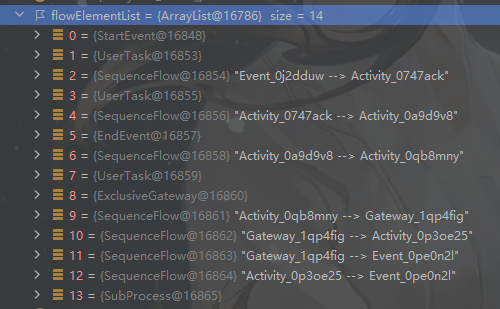
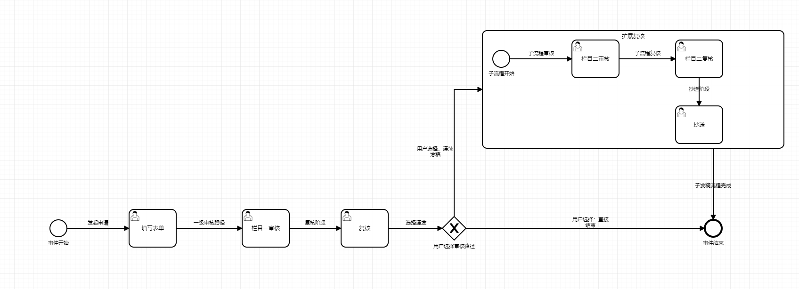

## 前言
我在[Activiti 7获取用户审核任务节点](/posts/workflow/toQueryTask)
这篇文章中已经讲到过如何获取流程ID和流程实例ID，并提到了`流程ID`、`流程实例ID`、`流程定义ID`的区别。

为什么要获取流程所有节点以及节点流转的详细信息呢？这是一个浩大的工程。但是最终目的只有一个：

> 向面向多租户的流程中台靠近

此时再想想这篇文章撰写的意义，根本就在于`通过流程定义信息去获取状态定义信息`，然后我们根据流程节点的抽象信息
，去构造具体的状态转移过程，然后达成`以流程中台流程节点转换，驱动租户端状态机变换`，最终达成租户系统内状态机变迁
由流程中台控制的过程。

## 准备
> 在正式开始写代码之前，我们需要搞清楚目标。

我在看了activiti 7这一块的源码之后，梳理出来这样一套思路：

### 思路整理
如何由一个流程定义ID甚至流程实例ID，最终得到流程的所有节点信息呢？
1. 先得到流程定义ID，这个在上一篇文章中已经提到过了。
2. 通过流程运行时的`repositoryService`获取到流程定义ID下的流程Bpmn实例。
3. 获取到该Bpmn实例下的一个流程对象（一般来说只有一个）。
4. 获取到该流程对象的所有流程元素。
5. 处理好流程元素，然后发送给租户端，这样在状态迁移时，租户端可以准确知道自己在BPMN图里运行到了哪个步骤。

### 进一步思考
有了这个思路以后，就可以着手开始规划代码设计了。
但是现在有一个更重要的问题：
流程对象的所有流程元素获取以后，是一个FlowElement集合，类似这样：
```java
//返回数据，这里开始对流程信息进行解构，获取到所有用户任务。因为用户任务才能参与审核，审核才会唤醒流转，流转才会改变状态
        Collection<FlowElement> flowElements = process.getFlowElements();
```
进一步查看源码，发现了一件更恐怖的事情，FlowElement，有`42个子类`！

聪明的你一定会想到，该设计模式出马啦！
那么去使用什么策略模式呢？策略模式？组合策略模式？还是责任链模式？

除了这个问题以外，还有个更急迫的问题，如何定义一个统一的对象来表示流程要素呢？

## 设计
带着如上问题，开始设计代码，并着手解决存在的问题。
### 定义统一对象
还是如刚开始所说，我们的目的只是让租户端知道整个流程的运行进度，那么只需要告诉租户端这样几大要素即可：
- 元素结点ID
- 前驱结点ID
- 后置结点ID
- 结点名称
- 结点类型
- 子结点集合

这样我们就可以构建一张完整的流程图出来。
由此我们可以得到这个流程返回对象的代码：
`FlowProcess.java`
```java
@Data
@AllArgsConstructor
@NoArgsConstructor
public class FlowProcess {
    /**
     * 当前流程元素ID
     */
    private String flowId;
    /**
     * 前一个流程元素ID
     */
    private String prev;
    /**
     * 后一个流程元素ID
     */
    private String next;
    /**
     * 流程元素名称
     */
    private String flowName;
    /**
     * 流程元素类型
     */
    private String flowType;
    /**
     * 流程节点所指向的子流程（需要注意，有这个标记的，一定是子流程的外围表达框图）
     */
    private Collection<FlowProcess> subProcess;

}
```
### 顶层设计
所以我们的期望是，通过一个流程定义ID，最终`获取到统一节点对象集合返回`。因此这个方法可以大致这样写：
```java
/**
     * 获取到对应流程定义ID的整体流程信息
     * @param definitionId 流程定义信息ID
     * @return 流程定义信息
     */

    public List<FlowProcess> getFlowElementsByProcessDefinition(String definitionId){
//        获取到流程的模型实例
        BpmnModel bpmnModel = repositoryService.getBpmnModel(definitionId);
//        在模型的流程表里选择第一个流程作为流程对象定义（一般也只有一个）
        Process process = bpmnModel.getProcesses().get(0);
//        这里开始对流程信息进行解构，获取到所有任务。其中用户任务才能参与审核，审核才会唤醒流转，流转才会改变状态
//        而路径元素更多的是指示两个非路径元素的连接方式
        Collection<FlowElement> flowElements = process.getFlowElements();
//        获取到流程路径定义
        return FlowElementUtil.getFlowDefinitionMap(flowElements);
    }
```
### 简化

#### 类型抽象

这里可以自己在process这一行打个断点看看，一个流程的定义是如何被存储和表示的，才好写代码。我在这里给一个示例的流程。这个流程应该算是单个流程里边比较复杂的了。



这个流程实际的效果图如下：



可以看到，这些基本上就是要用的元素了，其中包括：`开始事件`、`结束事件`、`用户任务`、`网关`、`子流程`、`流转路径`

所以说我们基本上只需要对这些内容进行整理即可。

#### 设计简化

这里主要是有一个上文未提及的好消息，那就是`FlowElement是一个抽象类`：

```java
public abstract class FlowElement extends BaseElement implements HasExecutionListeners {
    protected String name;
    protected String documentation;
    protected List<ActivitiListener> executionListeners = new ArrayList();
    protected FlowElementsContainer parentContainer;
}
```

而其父级BaseEvent有：

```java
public abstract class BaseElement implements HasExtensionAttributes {
    protected String id;
    protected int xmlRowNumber;
    protected int xmlColumnNumber;
}
```

再结合我们的FlowProcess一看，必要元素好像只差前驱后置结点和子流程了。

但是前驱后置节点只有路径元素有，子流程只有子流程元素有。

那么代码就好写多了，我们只需要把`路径流转元素`和`子流程元素`全部挑出来就行了。

### 设计模式

那么在上述问题一一迎刃而解后，我们需要明确，如何去获取到一个统一的返回对象呢？

以及有这么两种类型需要判断，我们如何去解决？

很容易想到，使用`策略模式`来解决。所以说在统一返回对象的问题上，我们使用策略模式来解决不同类不同字段的问题，这样更方便后期扩展。

### 类型表示

我们注意到，还有一个流程类型的字段不知道怎么用。那肯定是用来存`流程的class类型`的啦。

这样，租户端就知道这是个什么节点了。获取class名称很简单，只需要`obj.getClass().getName()`就可以获取到，但是这样获取到的是一个全限定名称，而我们只需要一个简单的类名即可，所以可以写一个简单的方法来获取：

```java
    /***
     * 通过全限定类名称获取类的直接名称
     * @param fullClassName 全限定名称
     * @return 类名
     */
    public static String getClassNameByFullClassName(String fullClassName){
        //通过ASCII码来切割点号。
        int index = fullClassName.lastIndexOf(46);
//        如果没命中直接返回，否则返回全限定名称转换后的名称
        return index==-1?fullClassName:fullClassName.substring(index+1);
    }
```

## 编码

> 在了解上述需求和问题的解决方案后，我们就可以开始着手去解决问题了

那么切入点就是：

```java
List<FlowProcess> flowDefinitionMap=FlowElementUtil.getFlowDefinitionMap(flowElements);
```

### 获取流程信息

有了这个flowElement集合，我们首先需要传入一个单独的方法进行处理，而不是在原本的方法里循环处理，至于为什么，等到了解子流程的组织之后你就懂了：

```java
    /**
     * 获取流程定义图（注意，是图，存在多级的巡向和父子关系，一个节点可能有好几个父子关系）
     * 可能存在：
     * 1.顺序流程
     * 2.排他网关并线
     * 3.子流程
     * 4.嵌套子流程
     * 5.自子流程内连续越级进入主流程的现象
     * @param flowElements 流程顶层节点
     * @return 流程数据
     */
    public static List<FlowProcess> getFlowDefinitionMap(Collection<FlowElement> flowElements){
        List<FlowProcess> processes=new LinkedList<>();
//        循环element,找到流程定义
        for (FlowElement element : flowElements) {
            processes.add(getFlowProcessByFlowElement(element));
        }
        return processes;
    }
```

很明显，我们把一个流程，先抽象成了多个流程节点的集合，然后在流程节点里进行循环，逐个击破。

所以还需要另外一个处理单个流程元素的方法，来对单个元素进行处理：

```java
    private static FlowProcess getFlowProcessByFlowElement(FlowElement flowElement){
//        获取统一的返回对象的代码
//		  ...

        //返回结果
        return ...;
    }
```

### 执行策略

此时我们就需要一个策略类了，策略类应该包括：

1.对注册的策略的处理

2.对未注册的策略的统一处理

#### 策略类定义

```java
/**
 * 策略执行类接口
 */
public interface FlowElementStrategy {
    FlowProcess execute(FlowElement flowElement);
}
```

只需要后续的实际处理类都来继承这个策略接口即可。

#### 流转节点策略

在这里，我们对流转策略进行处理

```java
/**
 * 中间流程路径节点
 */
public class SequenceFlowElementStrategy implements FlowElementStrategy {
    @Override
    public FlowProcess execute(FlowElement flowElement) {
        SequenceFlow element = (SequenceFlow) flowElement;
        return new FlowProcess(element.getId(), element.getSourceRef(), element.getTargetRef(),
                element.getName(), StringUtils.getClassNameByFullClassName(flowElement.getClass().getName()),null);
    }
}
```

只需要转入的时候直接强转类型就行，因为系统已经可以识别到这个属于流转元素类型了。

我们需要做的是，针对流转路径元素，注意`拿到它的前驱结点和后置结点`。

#### 子流程节点策略

与流转节点大致相同，不同的是，在子流程节点，我们需要获取子流程的详细定义，这个肯定是需要递归的，那么怎么实现类似递归呢？

```java
public class SubProcessFlowElementStrategy implements FlowElementStrategy {
    @Override
    public FlowProcess execute(FlowElement flowElement) {
//        对于
        SubProcess element = (SubProcess) flowElement;
        return new FlowProcess(element.getId(),null,null,
                flowElement.getName(),
                StringUtils.getClassNameByFullClassName(flowElement.getClass().getName()),
                FlowElementUtil.getFlowDefinitionMap(element.getFlowElements()));
    }
}
```

没错，再去调`FlowElementUtil.getFlowDefinitionMap()`方法即可。这也可以解答前边那个问题了，为什么不在方法里循环，而是单独抽出来，原因就是在这里去实现类似递归的方式，深层递归流程的每一个元素。

#### 策略执行

有了上述流程，我们需要一个执行类，去封装执行所有策略。

容易预见的是，直接使用类的class对象即可。

```java
public class FlowElementStrategyExecutor {
    private final Map<Class<?>, FlowElementStrategy> strategies;

    public FlowElementStrategyExecutor() {
        this.strategies = new HashMap<>();
        //TODO: 注册所有不可忽略的策略
//        流转流程元素（需要处理前后节点的组织关系）
        strategies.put(SequenceFlow.class,new SequenceFlowElementStrategy());
//        子流程元素（需要处理子流程的构造逻辑）
        strategies.put(SubProcess.class,new SubProcessFlowElementStrategy());
    }

    public FlowProcess executeStrategy(FlowElement flowElement) {
//        根据流程类型，选择执行对应的操作去处理元素节点组织关系
        Class<?> flowElementClass = flowElement.getClass();
        FlowElementStrategy strategy = strategies.get(flowElementClass);
//        匹配到策略，执行对应的处理
        if (strategy != null) {
            return strategy.execute(flowElement);
        }
    }
}
```

#### 无策略处理

如果没有对应的策略应该怎么办呢？上文已经提到了，FlowElement是个抽象类，它里边的元素已经满足了大部分子类的需求了，那么只需要改写`executeStrategy`方法：

```java
    public FlowProcess executeStrategy(FlowElement flowElement) {
//        根据流程类型，选择执行对应的操作去处理元素节点组织关系
        Class<?> flowElementClass = flowElement.getClass();
        FlowElementStrategy strategy = strategies.get(flowElementClass);
//        匹配到策略，执行对应的处理
        if (strategy != null) {
            return strategy.execute(flowElement);
        } else {
            // 如果没有匹配的策略，返回未识别实例类型（也可能是下述操作已经足够满足获取逻辑了）
            return new FlowProcess(flowElement.getId(),null,null,flowElement.getName(), StringUtils.getClassNameByFullClassName(flowElement.getClass().getName()),null);
        }
    }
```

加一串没有匹配的方法即可。

### 实例化策略

在编写好策略以后，就可以实例化使用了：

```java
public class FlowElementUtil {
    private static final FlowElementStrategyExecutor executor;

    /**
     * 工具类加载初始化时，注册策略类
     */
    static {
        executor = new FlowElementStrategyExecutor();
    }
}
```

然后在我们还没写完的这个private方法里去调用：

```java
    private static FlowProcess getFlowProcessByFlowElement(FlowElement flowElement){
//        获取流程
        FlowProcess flowProcess = executor.executeStrategy(flowElement);
//        为没有名字的节点加上默认名字
        if (flowProcess.getFlowName()==null) flowProcess.setFlowName("未命名流程节点");
        return flowProcess;
    }
```

大功告成。
